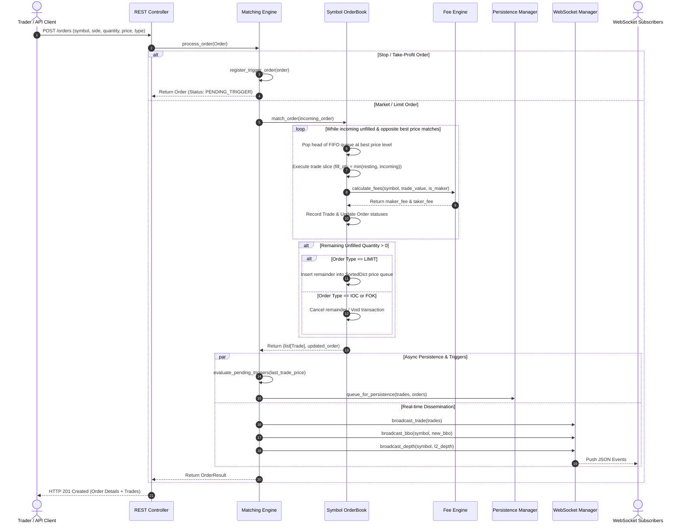
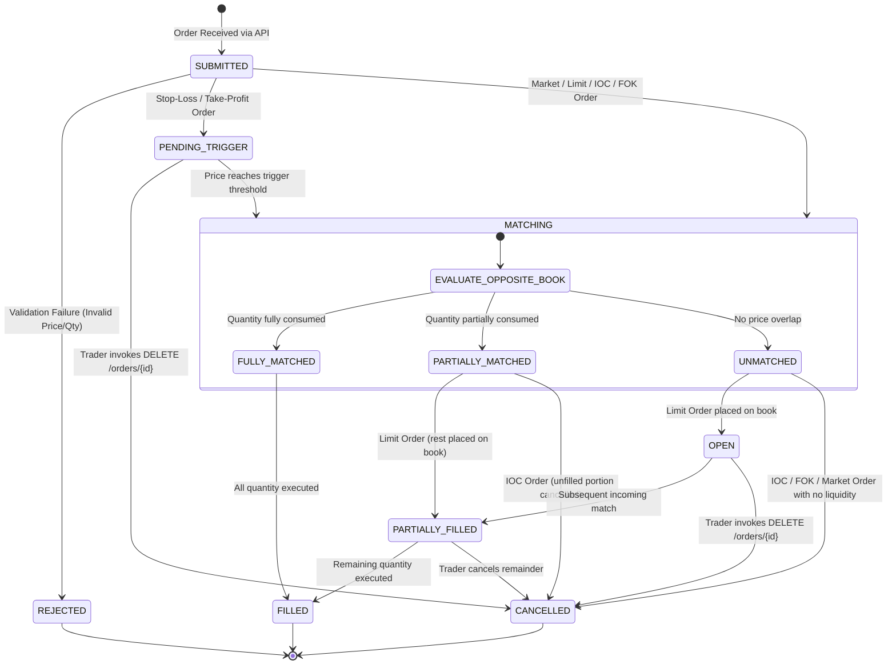
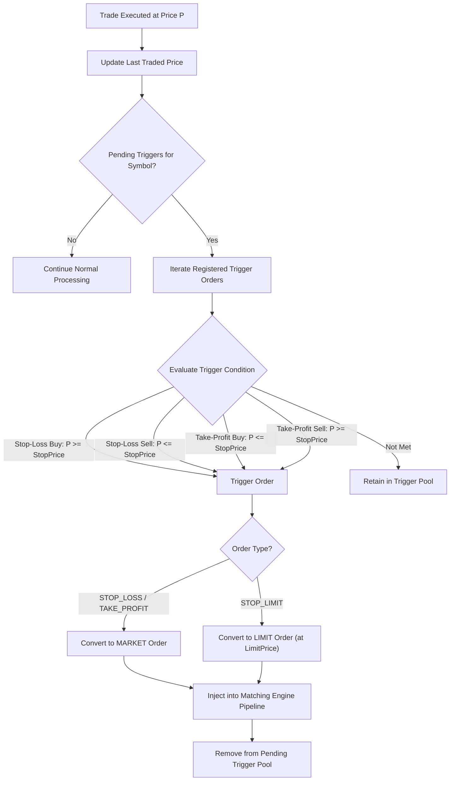
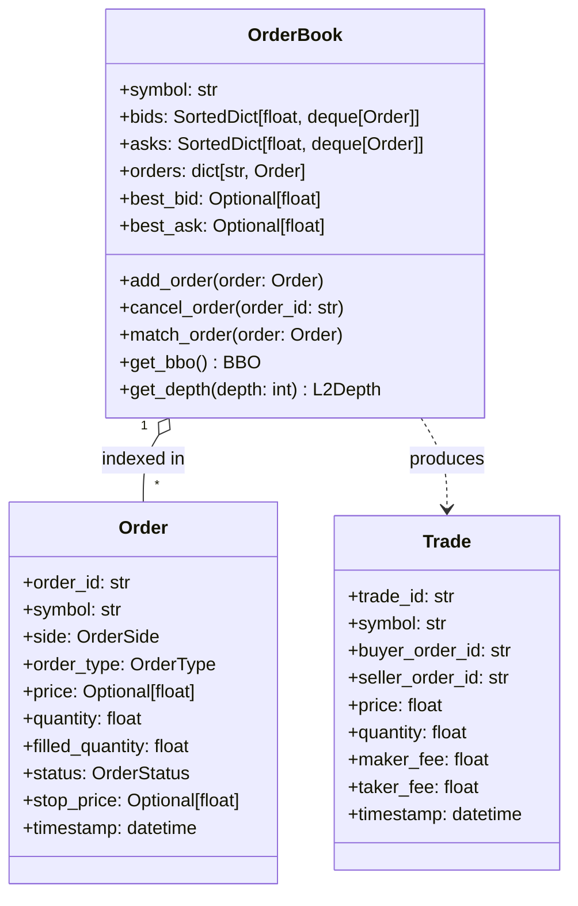
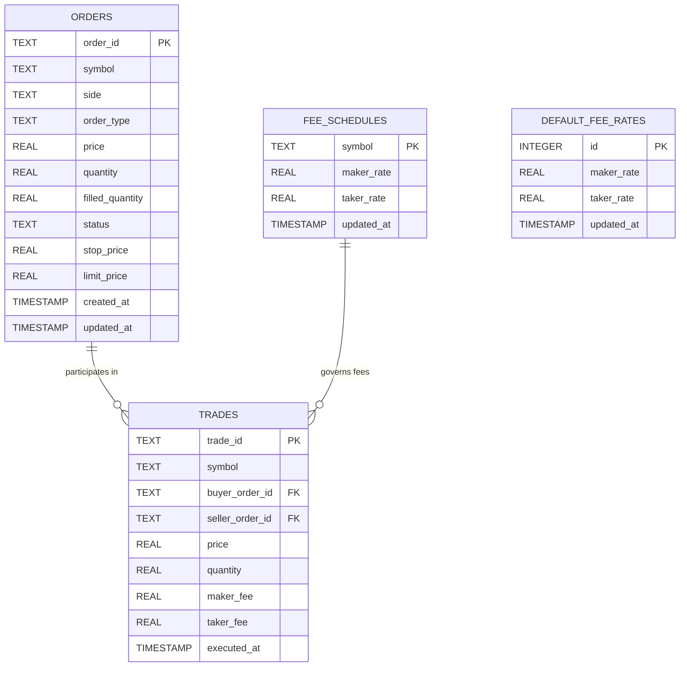
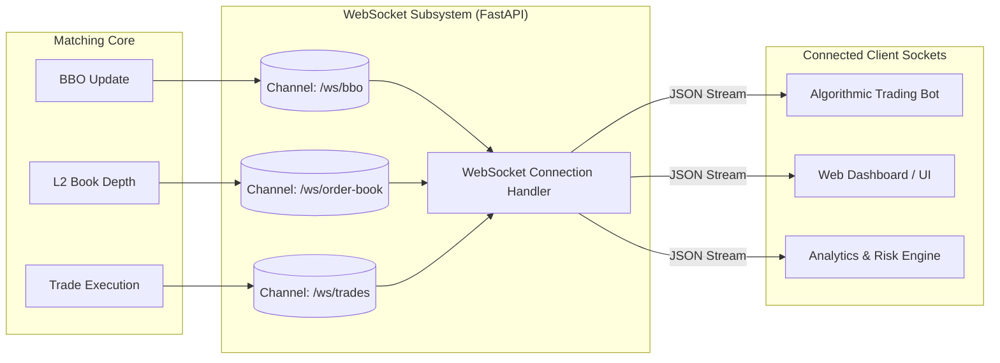

# Cryptocurrency Matching Engine - Architecture Documentation

A high-throughput, low-latency cryptocurrency matching engine architecture built with **Python 3.10+**, **FastAPI**, **SortedContainers**, and **SQLite**. The system implements **REG NMS-inspired** principles of price-time priority, internal order protection (anti-trade-through), maker-taker fee structures, and real-time market data dissemination.

---

## Table of Contents
- [1. High-Level System Architecture](#1-high-level-system-architecture)
- [2. Component Breakdown](#2-component-breakdown)
- [3. Order Processing & Matching Flow](#3-order-processing--matching-flow)
- [4. Order Lifecycle & State Machine](#4-order-lifecycle--state-machine)
- [5. Advanced Order Trigger Workflow](#5-advanced-order-trigger-workflow)
- [6. In-Memory Data Structures & Complexity](#6-in-memory-data-structures--complexity)
- [7. Persistence Layer & Crash Recovery](#7-persistence-layer--crash-recovery)
- [8. Real-Time WebSocket Streaming Subsystem](#8-real-time-websocket-streaming-subsystem)
- [9. Performance & Concurrency Trade-Offs](#9-performance--concurrency-trade-offs)

---

## 1. High-Level System Architecture

The engine adopts a decoupled layered architecture separating **Network Ingestion (REST & WebSockets)**, **In-Memory Core Execution**, and **Asynchronous Persistence**.

```mermaid
flowchart TB
    subgraph Clients ["Client Applications & Trading Bots"]
        HTTP_Client["REST API Clients / Webhooks"]
        WS_Client["WebSocket Market Data Consumers"]
    end

    subgraph API_Layer ["API & Ingestion Layer (FastAPI)"]
        REST_Gateway["REST Controller\n(app/api/rest.py)"]
        WS_Gateway["WebSocket Controller\n(app/api/websocket.py)"]
        ConnManager["WebSocket Connection Manager\n(Topic Subscriptions)"]
    end

    subgraph Engine_Core ["Core Matching Engine (In-Memory)"]
        Engine["Matching Engine Coordinator\n(app/core/matching_engine.py)"]
        FeeEngine["Maker-Taker Fee Model\n(app/models/fee.py)"]
        TriggerManager["Pending Trigger Order Registry\n(Stop/Take-Profit)"]
        
        subgraph OrderBooks ["Symbol Order Books (e.g. BTC-USDT, ETH-USDT)"]
            OB["OrderBook Instance\n(app/core/order_book.py)"]
            Bids["Bids SortedDict\n(Desc Price -> FIFO Queue)"]
            Asks["Asks SortedDict\n(Asc Price -> FIFO Queue)"]
            Index["Order ID Lookup Map\n(O(1) Hash Map)"]
        end
    end

    subgraph Persistence ["Persistence & Durability Layer"]
        PManager["Persistence Manager\n(app/persistence/persistence_manager.py)"]
        DB[(SQLite Embedded DB\ntrading_app.db)]
        OrderRepo["Order Repository"]
        TradeRepo["Trade Repository"]
        FeeRepo["Fee Repository"]
    end

    %% Flow Connections
    HTTP_Client -->|Order Submissions & Queries| REST_Gateway
    WS_Client <-->|Subscribe & Stream Updates| WS_Gateway
    WS_Gateway --> ConnManager

    REST_Gateway -->|Submit / Cancel Orders| Engine
    Engine -->|Route to Symbol Book| OB
    OB --> Bids
    OB --> Asks
    OB --> Index

    Engine -->|Calculate Fees| FeeEngine
    Engine -->|Evaluate Trailing Triggers| TriggerManager
    TriggerManager -.->|Promote to Market/Limit| Engine

    Engine -->|Emit BBO, Depth & Trades| ConnManager
    ConnManager -->|Broadcast JSON Frames| WS_Client

    Engine -->|Sync State (Every 60s / Shutdown)| PManager
    PManager --> OrderRepo
    PManager --> TradeRepo
    PManager --> FeeRepo
    OrderRepo --> DB
    TradeRepo --> DB
    FeeRepo --> DB
```

---

## 2. Component Breakdown

| Component | Module Path | Primary Responsibility |
| :--- | :--- | :--- |
| **Matching Engine** | `app/core/matching_engine.py` | Central coordinator orchestrating order validation, symbol routing, trigger evaluation, fee calculation, and event broadcast. |
| **Order Book** | `app/core/order_book.py` | Manages bids/asks priority queues, executes matching loops, and maintains Best-Bid-Offer (BBO). |
| **Fee Model** | `app/models/fee.py` | Computes maker-taker fees with custom pair schedules and volume tier defaults. |
| **REST Gateway** | `app/api/rest.py` | FastAPI HTTP controllers for synchronous order lifecycle operations and market data queries. |
| **WebSocket Gateway** | `app/api/websocket.py` | Asynchronous pub-sub manager broadcasting BBO changes, L2 order book depth, and executed trade feeds. |
| **Persistence Manager** | `app/persistence/persistence_manager.py` | Snapshot engine persisting state to SQLite and restoring order books on crash/restart. |

---

## 3. Order Processing & Matching Flow

The sequence diagram below illustrates an incoming **Limit/Market Order** matched against resting liquidity, applying maker-taker fees, updating persistence, and streaming market data to subscribers:



---

## 4. Order Lifecycle & State Machine

Each order transitions through well-defined lifecycle states ensuring deterministic execution and accounting.



---

## 5. Advanced Order Trigger Workflow

Conditional orders (**Stop-Loss**, **Stop-Limit**, **Take-Profit**) reside in an indexed trigger pool outside the active order book to prevent book pollution until condition criteria are satisfied:



---

## 6. In-Memory Data Structures & Complexity

To deliver microsecond-tier throughput, the engine combines **Sorted Containers** and **Hash Indices**:



### Algorithmic Complexity Matrix

| Operation | Data Structure | Time Complexity | Notes |
| :--- | :--- | :---: | :--- |
| **Best Price Lookup (BBO)** | `SortedDict.keys()[-1]` (Bids) / `[0]` (Asks) | $\mathcal{O}(1)$ | Immediate top-of-book pointer |
| **Order Insertion (Resting)** | `SortedDict` + `collections.deque` | $\mathcal{O}(\log P)$ | $P$ = unique price levels, $\mathcal{O}(1)$ queue push |
| **Order Cancellation** | `dict` (ID lookup) + `deque.remove()` | $\mathcal{O}(1)$ avg | Direct hash lookup + pointer drop |
| **Time-Priority Execution** | `collections.deque.popleft()` | $\mathcal{O}(1)$ | Strict FIFO queue consumption |
| **Trigger Evaluation** | In-Memory Filter List | $\mathcal{O}(K)$ | $K$ = active pending conditional orders |

---

## 7. Persistence Layer & Crash Recovery

The engine uses a non-blocking asynchronous snapshotter backed by **SQLite (WAL Mode)** to ensure durability without penalizing the hot matching path.



### Crash Recovery Protocol
1. **Engine Startup**: `PersistenceManager.load_state()` initiates.
2. **Schema Validation**: SQLite table indices and WAL journaling are verified.
3. **Reconstruct Active Books**:
   - Query all `OPEN` and `PARTIALLY_FILLED` orders ordered by `created_at ASC`.
   - Re-insert into respective `OrderBook` instances (rebuilding identical FIFO priority without re-triggering matches).
4. **Restore Conditional Pool**: Re-populate `pending_trigger_orders` with active stops/take-profits.
5. **Fee Cache Invalidation**: Populate `FeeModel` with persisted symbol-specific fee schedules.

---

## 8. Real-Time WebSocket Streaming Subsystem

Market data is broadcast over low-latency WebSockets with granular channel subscriptions:



---

## 9. Performance & Concurrency Trade-Offs

### 1. In-Memory Execution vs. Disk I/O
- **Decision**: Keep the primary matching path 100% in-memory with periodic (60s) or shutdown-triggered SQLite flushes.
- **Rationale**: Disk I/O during order matching introduces unpredictable latency spikes. In-memory execution guarantees sub-millisecond execution.

### 2. Single-Threaded Core vs. Lock Contention
- **Decision**: Execute order matching synchronously per symbol while delegating API transport to asynchronous FastAPI coroutines.
- **Rationale**: Eliminates synchronization locks and mutex contention over order books, avoiding race conditions and deadlocks.

### 3. Price-Time Priority vs. Pro-Rata
- **Decision**: Strict Price-Time (FIFO) allocation adhering to REG NMS principles.
- **Rationale**: Protects limit order providers, eliminates front-running, and guarantees mathematical fairness in execution ordering.