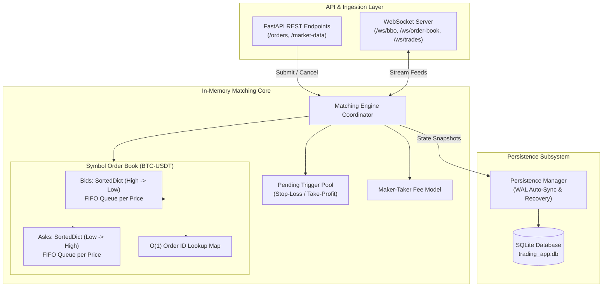

# Cryptocurrency Matching Engine

[](https://www.python.org/)
[](https://fastapi.tiangolo.com)
[](#reg-nms-principles)
[](https://sqlite.org/)
[](tests/)
[](LICENSE)

A high-performance, deterministic cryptocurrency matching engine implementing **REG NMS-inspired** principles of price-time priority, internal order protection (anti-trade-through), comprehensive maker-taker fee structures, and real-time market data streaming via WebSockets.

---

## System Architecture Overview



---

## Key Features

- **Strict Price-Time Priority**: Guarantees deterministic execution where the best price always matches first, and ties are broken strictly by arrival time (FIFO).
- **Internal Trade-Through Protection**: Full compliance with REG NMS principles, preventing executions that bypass superior resting prices.
- **7 Order Types Supported**:
  - `Market`: Immediate liquidity consumption at best available prices.
  - `Limit`: Rest on the book with maker fee advantage or match against resting liquidity.
  - `IOC (Immediate-Or-Cancel)`: Execute available volume immediately, cancel remaining.
  - `FOK (Fill-Or-Kill)`: All-or-none instantaneous atomic execution.
  - `Stop-Loss`: Triggers market order once stop price threshold is breached.
  - `Stop-Limit`: Triggers resting limit order at target price level.
  - `Take-Profit`: Automated profit-taking trigger order.
- **Maker-Taker Dynamic Fee Model**: Configurable default and per-trading-pair fee rates with automated maker/taker fee attribution on executed trades.
- **Low-Latency Real-Time Streaming**: Dedicated WebSocket channels for Best Bid & Offer (BBO), Level-2 Order Book Depth, and Trade execution feeds.
- **Crash Resilience & State Recovery**: Built-in SQLite persistence layer that periodically snapshots engine state and restores open orders and fee structures seamlessly on reboot.

---

## Data Structures & Algorithmic Complexity

| Operation | Implementation Structure | Time Complexity |
| :--- | :--- | :---: |
| **BBO Lookup** | `SortedDict` top key pointer | $\mathcal{O}(1)$ |
| **Order Placement (Resting)** | `SortedDict` + `collections.deque` | $\mathcal{O}(\log P)$ |
| **Order Matching (Execution)** | `collections.deque.popleft()` | $\mathcal{O}(1)$ |
| **Order Cancellation** | Hash Index + `deque.remove()` | $\mathcal{O}(1)$ avg |
| **Order ID Lookup** | Python `dict` Hash Map | $\mathcal{O}(1)$ |

---

## Quick Start

### 1. Installation

Clone the repository and install dependencies:

```bash
git clone https://github.com/prarthna2803/crypto-matching-engine.git
cd crypto-matching-engine
pip install -r requirements.txt
```

### 2. Run the Matching Engine Server

Start the FastAPI application:

```bash
python -m app.main
```
The server will start listening at `http://localhost:8000`. Interactive Swagger API documentation will be available at `http://localhost:8000/docs`.

---

## API Reference & Usage

### REST API Endpoints

| Method | Endpoint | Description |
| :--- | :--- | :--- |
| `POST` | `/orders` | Submit a new order (Market, Limit, Stop, FOK, IOC, etc.) |
| `DELETE` | `/orders/{order_id}` | Cancel an active or pending trigger order |
| `GET` | `/orders/{order_id}` | Retrieve real-time order status and execution details |
| `GET` | `/market-data/{symbol}/bbo` | Get Best Bid and Offer for a trading pair |
| `GET` | `/market-data/{symbol}/order-book` | Get L2 depth for a trading pair |
| `GET` | `/market-data/{symbol}/trades` | Fetch recent executed trades |
| `GET` | `/fee-schedules/{symbol}` | Get current fee schedule for a trading pair |
| `POST` | `/fee-schedules/{symbol}` | Configure custom maker/taker fee rates |

#### Example: Submit a Limit Buy Order
```bash
curl -X POST "http://localhost:8000/orders" \
  -H "Content-Type: application/json" \
  -d '{
    "symbol": "BTC-USDT",
    "order_type": "limit",
    "side": "buy",
    "quantity": 1.5,
    "price": 64500.00
  }'
```

#### Example: Submit a Stop-Loss Sell Order
```bash
curl -X POST "http://localhost:8000/orders" \
  -H "Content-Type: application/json" \
  -d '{
    "symbol": "BTC-USDT",
    "order_type": "stop_loss",
    "side": "sell",
    "quantity": 1.0,
    "stop_price": 63000.00
  }'
```

---

## WebSocket Real-Time Feeds

Connect to real-time streams at `ws://localhost:8000`:
- `/ws/bbo` - Instant Best Bid and Offer ticker updates
- `/ws/order-book` - Level 2 full order book depth snapshots
- `/ws/trades` - Real-time trade execution tape

#### JavaScript Client Example:
```javascript
const tradeSocket = new WebSocket('ws://localhost:8000/ws/trades');

tradeSocket.onopen = () => {
  tradeSocket.send(JSON.stringify({ action: 'subscribe', symbol: 'BTC-USDT' }));
};

tradeSocket.onmessage = (event) => {
  const trade = JSON.parse(event.data);
  console.log('Trade Executed:', trade);
};
```

---

## Running Automated Tests

Run the complete test suite with `pytest`:

```bash
# Run all unit and integration tests
pytest

# Test specific subsystem modules
pytest tests/test_order_book.py
pytest tests/test_matching_engine.py
pytest tests/test_advanced_orders.py
pytest tests/test_fee_model.py
pytest tests/test_persistence.py
```

---

## Detailed Documentation

For a comprehensive deep-dive into the architectural mechanics, state machines, sequence diagrams, and crash-recovery protocols, refer to [ARCHITECTURE.md](ARCHITECTURE.md).

---

## License

This project is licensed under the [MIT License](LICENSE).
